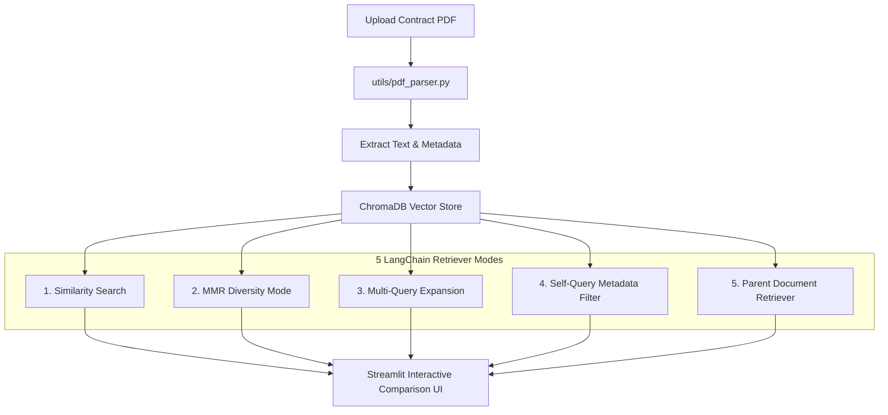

# 🦅 ContractClaw - AI Contract Analysis & LangChain Retriever Masterclass

[](https://www.python.org/downloads/)
[](https://streamlit.io/)
[](https://www.langchain.com/)
[](https://www.trychroma.com/)
[](LICENSE)

**ContractClaw** is a production-grade contract review application and interactive laboratory designed to teach and demonstrate 5 advanced **LangChain retrieval strategies** on legal PDF documents.

---

## 🎯 Key Features & Retriever Laboratories

1. **📄 PDF Ingestion & Automated Metadata Parsing:** Extracts full contract text alongside structured metadata (`contract_type`, `upload_date`, `filename`, `parties`) using custom regex heuristics and `pdfplumber`.
2. **🔵 Cosine Similarity Search Retriever:** Baseline vector search that calculates angular distance between query embeddings and chunk embeddings.
3. **🟢 Maximal Marginal Relevance (MMR) Retriever:** Eliminates result redundancy to surface diverse contractual risks (payment terms, IP rights, liability caps) using a tuneable $\lambda$ factor.
4. **🧠 Multi-Query Retriever:** Uses LLMs to translate vague user prompts into 3–5 specialized legal queries, casting a wider retrieval net.
5. **🏷️ Self-Query Retriever:** Extracts structured metadata filters directly from natural language (e.g., `"Find NDAs uploaded last month"` $\rightarrow$ `contract_type == "NDA"`).
6. **🧩 Parent Document Retriever:** Implements small-to-big retrieval by embedding small child chunks (400 chars) for high vector accuracy while returning full parent chunks (2000 chars) for complete context.

---

## 🏗️ Architecture & Workflow Diagram



---

## 📂 Repository Structure

```text
contractclaw/
├── app.py                      # Main Streamlit Dashboard
├── config.py                   # Global environment and paths
├── requirements.txt            # Python dependencies
├── generate_samples.py         # Programmatic sample contract generator
├── .env.example                # API key configuration template
├── README.md                   # Comprehensive repository guide
│
├── utils/                      # Ingestion & chunking utilities
│   ├── pdf_parser.py           # Text & metadata extraction pipeline
│   └── text_splitters.py       # Recursive character text splitters
│
├── retrievers/                 # LangChain retriever implementations
│   ├── base_retriever.py       # ChromaDB vector store manager
│   ├── similarity_retriever.py # Cosine Similarity Retriever
│   ├── mmr_retriever.py        # Maximal Marginal Relevance Retriever
│   ├── multi_query_retriever.py# (Module 4) Multi-Query Retriever
│   ├── self_query_retriever.py # (Module 5) Self-Query Retriever
│   └── parent_doc_retriever.py # (Module 6) Parent Document Retriever
│
├── ui/                         # Streamlit UI visual components
│   └── components.py           # Metric cards, expanders, and result viewers
│
├── sample_contracts/           # Generated sample NDA, Employment, MSA PDFs
└── tests/                      # Automated test suite
```

---

## ⚡ Quick Start Guide

### 1. Clone & Navigate
```bash
git clone https://github.com/ShaniOnGitHub/ContractClaw.git
cd ContractClaw
```

### 2. Environment Setup & Dependencies
```bash
python -m venv venv
# On Windows:
venv\Scripts\activate
# On Linux/macOS:
source venv/bin/activate

pip install -r requirements.txt
```

### 3. API Keys Configuration
Create a `.env` file in the root directory:
```env
OPENAI_API_KEY=your_openai_api_key_here
GROQ_API_KEY=your_groq_api_key_here
```
*(Note: ContractClaw falls back to local HuggingFace embeddings `all-MiniLM-L6-v2` if no OpenAI key is present!)*

### 4. Run Sample Generator & Launch Streamlit App
```bash
python generate_samples.py
streamlit run app.py
```

---

## 🧪 Running Tests
```bash
python test_ingestion.py
python test_similarity_retriever.py
python test_mmr_retriever.py
```

---

## 📜 License
Distributed under the MIT License. See `LICENSE` for more information.
