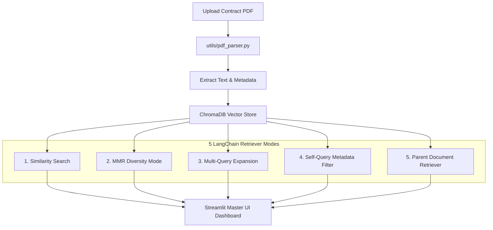

# 🦅 ContractClaw - AI Contract Analysis & LangChain Retriever Masterclass

[](https://www.python.org/downloads/)
[](https://streamlit.io/)
[](https://www.langchain.com/)
[](https://www.trychroma.com/)
[](Dockerfile)
[](LICENSE)

**ContractClaw** is a production-grade contract review application and interactive laboratory designed to teach and demonstrate 5 advanced **LangChain retrieval strategies** on legal PDF documents.

---

## 🎯 Key Features & Retriever Laboratories

1. **📄 PDF Ingestion & Automated Metadata Parsing:** Extracts full contract text alongside structured metadata (`contract_type`, `upload_date`, `filename`, `parties`) using custom regex heuristics and `pdfplumber`.
2. **🔵 Cosine Similarity Search Retriever:** Baseline vector search that calculates angular distance between query embeddings and chunk embeddings.
3. **🟢 Maximal Marginal Relevance (MMR) Retriever:** Eliminates result redundancy to surface diverse contractual risks (payment terms, IP rights, liability caps) using a tuneable $\lambda$ factor.
4. **🧠 Multi-Query Retriever:** Uses LLMs to translate vague user prompts into 3–5 specialized legal queries, casting a wider retrieval net.
5. **🏷️ Self-Query Retriever:** Extracts structured metadata filters directly from natural language (e.g., `"Find NDAs uploaded last month"` $\rightarrow$ `contract_type == "NDA"`).
6. **🧩 Parent Document Retriever:** Implements small-to-big retrieval by embedding small child chunks (400 chars) for high vector accuracy while returning full parent chunks (2000 chars) for complete context.
7. **🔬 Compare Modes Laboratory:** Enables side-by-side benchmarking of any 2 retriever strategies on the exact same user query.

---

## 🏗️ Architecture & Workflow Diagram



---

## 💎 Commercial SaaS Monetization Plan

| Feature / Tier | 🆓 Free Starter | ⭐ Pro Plan ($19/mo) | 🏢 Enterprise ($49/mo) |
|---|---|---|---|
| Contract Reviews | 3 / Month | **Unlimited** | **Unlimited** |
| Retrievers Included | Similarity Search | **All 5 Retrievers + Compare Lab** | **All 5 Retrievers** |
| Document Upload | Single PDF | **Batch Multi-PDF Upload** | **Batch Multi-PDF Upload** |
| Report Export | ❌ | **Export PDF / Word Audit Reports** | **Export PDF / Word Reports** |
| Risk Index Score | ❌ | **1-100 Automated Legal Risk Index** | **1-100 Legal Risk Index** |
| Infrastructure | Shared | Shared | **Dedicated Vector Cluster** |

---

## ⚡ Local Setup Guide

### 1. Clone Repository
```bash
git clone https://github.com/ShaniOnGitHub/ContractClaw.git
cd ContractClaw
```

### 2. Environment Setup & Dependencies
```bash
python -m venv venv
# Windows:
venv\Scripts\activate
# Linux/macOS:
source venv/bin/activate

pip install -r requirements.txt
```

### 3. API Keys Configuration
Create a `.env` file in the root directory:
```env
OPENAI_API_KEY=your_openai_api_key_here
GROQ_API_KEY=your_groq_api_key_here
```
*(ContractClaw automatically falls back to local HuggingFace embeddings `all-MiniLM-L6-v2` if no OpenAI key is present!)*

### 4. Run Sample Generator & Launch App
```bash
python generate_samples.py
streamlit run app.py
```

---

## 🐳 Docker Deployment

To build and run ContractClaw using Docker:
```bash
docker build -t contractclaw .
docker run -p 8501:8501 --env-file .env contractclaw
```
Navigate to `http://localhost:8501` in your browser.

---

## ☁️ Streamlit Community Cloud Deployment

1. Fork or push this repository to your GitHub account (`https://github.com/ShaniOnGitHub/ContractClaw`).
2. Log into [share.streamlit.io](https://share.streamlit.io/).
3. Click **New App** $\rightarrow$ Select repository `ContractClaw`, branch `main`, and main file path `app.py`.
4. In Advanced Settings $\rightarrow$ Add `OPENAI_API_KEY` and `GROQ_API_KEY` under **Secrets**.
5. Click **Deploy!**

---

## 🧪 Unified Test Suite

To run all automated retriever tests:
```bash
python tests/run_all.py
```

---

## 📜 License
Distributed under the MIT License. See [`LICENSE`](LICENSE) for details.
