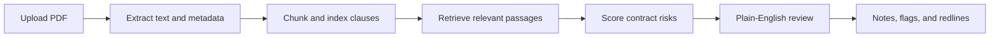

# ContractClaw

[](https://github.com/ShaniOnGitHub/ContractClaw/actions/workflows/ci.yml)
[](https://contractclaw.up.railway.app)
[](https://www.python.org/)
[](https://react.dev/)
[](LICENSE)

**ContractClaw** is a plain-English AI contract review workspace. Upload a legal PDF, receive a simple risk score, understand the important findings, and see what deserves attention before signing.

[Open ContractClaw](https://contractclaw.up.railway.app) · [Report an issue](https://github.com/ShaniOnGitHub/ContractClaw/issues)

## Product overview

ContractClaw is designed for people who need a useful first review without having to decode a dense legal or technical report. The analysis experience puts the overall score first, explains findings in everyday language, and gives each issue a direct next step.

The application includes:

| Area | What it does |
|---|---|
| Contract upload | Accepts PDF contracts and extracts the document text and metadata. |
| Risk review | Produces a score and highlights clauses that may deserve attention. |
| Plain-English findings | Explains what an issue means and what to consider doing next. |
| Contract library | Keeps analyzed contracts available for later review. |
| Compare | Lets users compare retrieval approaches on the same contract question. |
| Playbooks | Provides reusable review guidance for common contract concerns. |
| Notes and redlines | Preserves existing review workflows for private notes, flags, and proposed redlines. |

> **Important:** ContractClaw is an analysis aid, not a replacement for advice from a qualified lawyer.

## How it works



The backend uses FastAPI and a retrieval pipeline built around ChromaDB and LangChain-compatible retrievers. The React frontend is built with Vite and is served by the same FastAPI process in production, so the deployed application has one public URL for both the interface and API.

## Technology

| Layer | Technology |
|---|---|
| Frontend | React 19, Vite, TypeScript, Tailwind CSS, Lucide icons |
| Backend | Python 3.11+, FastAPI, Uvicorn |
| Retrieval | ChromaDB, LangChain retrievers, similarity and MMR modes |
| Document processing | `pdfplumber`, `pypdf`, and generated sample contracts |
| AI integrations | OpenAI-compatible analysis with local embedding fallback |
| Deployment | Railway single-service deployment; frontend bundle embedded in the repository |
| License | MIT |

## Run locally

### 1. Clone and create an environment

```bash
git clone https://github.com/ShaniOnGitHub/ContractClaw.git
cd ContractClaw
python -m venv .venv
source .venv/bin/activate       # Windows: .venv\\Scripts\\activate
pip install -r requirements.txt
```

### 2. Configure environment variables

Copy `.env.example` to `.env` and provide the keys needed for your environment. The application can use local Hugging Face embeddings when an OpenAI embedding configuration is unavailable.

```bash
cp .env.example .env
```

### 3. Build the frontend

```bash
cd frontend
npm install
npm run build
cd ..
```

### 4. Start the combined application

```bash
python main.py
```

Open `http://localhost:8000` in a browser.

## Tests

The focused CI checks generate sample contracts and run the ingestion, similarity retriever, and MMR retriever tests on Python 3.11:

```bash
python generate_samples.py
pytest -q tests/test_ingestion.py tests/test_similarity_retriever.py tests/test_mmr_retriever.py
```

The repository also contains the broader regression suite under `tests/`. To run it locally:

```bash
pytest -q
```

## Deployment

Railway deploys the `main` branch using the repository’s `railway.json` configuration. The service builds the React frontend and starts FastAPI through `main.py`. The production URL is [contractclaw.up.railway.app](https://contractclaw.up.railway.app).

For deployment configuration details, see [`HOSTING.md`](HOSTING.md). For contribution or issue reports, use the repository’s [Issues page](https://github.com/ShaniOnGitHub/ContractClaw/issues).

## Repository layout

```text
frontend/       React application and production bundle
services/       Authentication, analysis, and application services
retrievers/     Retrieval strategies used by contract analysis
tests/          Regression and feature tests
api.py          FastAPI routes and frontend serving
main.py         Portable production entry point
generate_samples.py  Local and CI sample-contract generator
railway.json    Railway build and deployment configuration
```

## License

ContractClaw is distributed under the MIT License. See [`LICENSE`](LICENSE).
